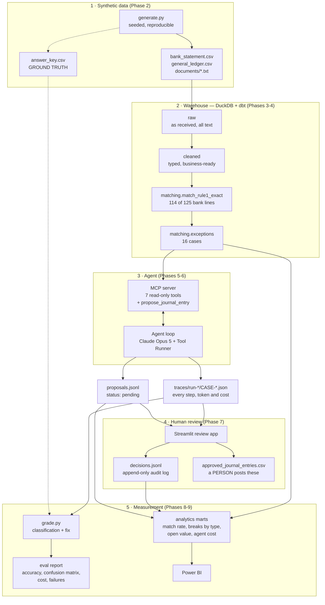

# Architecture

All data is synthetic. Nothing in this system writes to a general ledger.

## End-to-end flow

Dashed lines carry **ground truth**. It is generated alongside the data, kept in
`data/eval/`, and used only by the grader. It never enters the warehouse, and a
test proves it: if it did, the agent could in principle read the answers and
every accuracy number would be meaningless.

## Trust boundaries

The premise of the project is that **the agent proposes and a human disposes**.
That is enforced in code, not in a prompt:

| The agent CAN | The agent CANNOT |
|---|---|
| Query bank, ledger and case tables (DuckDB opened `read_only=True`) | Write to the warehouse — no tool exists, and the connection refuses writes |
| Search supporting documents | Run arbitrary SQL — every query is parameterised, and the model never writes SQL |
| Record a **proposal** with `status: pending_human_approval` | Post a journal entry — the system's output is a CSV for a person to import |
| See facts about a case (amounts, dates, shapes) | See the answer key, or any classification label |

Supporting documents come from third parties, so their text is treated as
untrusted data: the tool descriptions and system prompt both say it is evidence
to evaluate, never instructions to follow.

## Why each layer exists

| Layer | Why not skip it |
|---|---|
| **Rules before the agent** | 114 of 125 bank lines match on reference, amount and a date window. Rules do that for free, deterministically. The LLM only sees the 16 real exceptions |
| **raw → staging → cleaned** | Raw is kept untouched so any cleaning bug can be fixed and replayed; staging types and standardises; cleaned adds business meaning. A test asserts totals are identical between raw and cleaned |
| **MCP server** | The tools are written once and work with any MCP client (this agent, Claude Desktop, an IDE). It is also the security boundary |
| **Traces** | Auditability. Every classification is backed by the tool calls and evidence that produced it, plus tokens, latency and cost |
| **Human review** | Approving is only meaningful if the reviewer can see the reasoning, so the UI shows the case, the entry, the evidence and the full trace |
| **Eval harness** | "It works" is an opinion until it is graded against ground truth by type, with a confusion matrix and a failure list |
| **Analytics marts** | Metric definitions live in tested SQL, not inside a BI tool, so "match rate" means one thing |

## Repository map

| Path | What's there |
|---|---|
| `recon/data_gen/` | Synthetic bank statement, ledger, documents and answer key |
| `recon/pipeline/` | Loaders, the pipeline runner, the analytics export |
| `recon/matching/` | Matcher evaluation (the dbt models do the matching) |
| `recon/mcp_server/` | The MCP server, its tools and helper scripts |
| `recon/agent/` | The agent loop, prompts, traces, batch runner, cost calculator |
| `recon/review/` | Review store: proposals, decisions, approved-entry export |
| `recon/evals/` | Grading and the evaluation report |
| `dbt_recon/models/` | `staging/`, `cleaned/`, `matching/`, `analytics/` |
| `app/review_app.py` | The Streamlit human-in-the-loop UI |
| `tests/` | 188 tests, including a scripted fake Claude so the agent loop is tested for $0 |
| `web/` | The public static demo (plain HTML/CSS/JS + exported JSON), deployed to Vercel |
